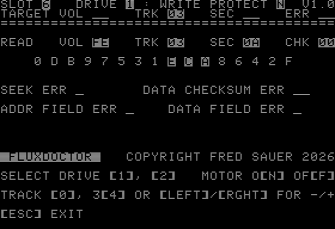

# **`FLUXDOCTOR`** v1.0 for Apple II computers

Apple Disk II diagnostic utility for real-time
troubleshooting, diagnositcs, and repair.



Available as a bootable DOS 3.3 (140kB) floppy disk image (`FLUXDOCTOR.DO`).

`FLUXDOCTOR` currently requires a system that was booted from a DOS 3.3 disk as
it expects a DOS 3.3 environment and utilizes `RWTS` routines for track seeks.
Real time reading of disk data is done directly from 6502 assembly.


# Prerequisites

1. To be able to compile FLUXDOCTOR from source, install **dasm** assembler from
   https://dasm-assembler.github.io/

3. To manipulate disk images and add the compiled `FLUXDOCTOR` binary to a
   DOS 3.3 disk image, install **AppleCommander** from
   https://applecommander.github.io/ac/

4. (Windows only) To be able to run in the provided shell scripts, install
   [Git BASH](https://gitforwindows.org/), or install
   [Windows Subsystem for Linux (WSL)](https://en.wikipedia.org/wiki/Windows_Subsystem_for_Linux)


# Build instructions

```
./run.sh
```

# Writing physical floppy disks

There many options to choose from, including:

## Greaseweazle

Purchase a [Greaseweazle](https://github.com/keirf/greaseweazle). Then, to write
the 35-track 140kB `fluxdoctor.do` DOS 3.3 floppy disk image to a double density
floppy disk using a standard (80 track) 5.25" PC floppy drive, simply specify
`--tracks=step=2` when using the `gw` command:

```
gw write --tracks=step=2 fluxdoctor.do
```

## ADTPro

Use [ADTPro](https://github.com/ADTPro/adtpro) to write physical disk images
using your Apple II system, using an audio cable and cassette port on your
Apple II.

## c2t

Use [c2t](https://github.com/datajerk/c2t), the same tool that powers
https://asciiexpress.net/ to create a WAV file you can just send to your
Apple II using an audio cable. Works even if you don't (yet) have a bootable
floppy disk.

To compile `c2t.exe` on Windows, install the
[MSYS2](https://www.msys2.org/docs/environments/) `UCRT64` environment.

```
cp fluxdoctor.do fluxdoctor.dsk
c2t fluxdoctor.dsk fluxdoctor.wav
```


# Testing

Install an Apple II emulator for local testing, such as
   - Web browser: [appleiijs](https://www.scullinsteel.com/apple2/) /
     [appleiijse](https://www.scullinsteel.com/apple//e)
   - macOS / linux: see
     https://en.wikipedia.org/wiki/List_of_computer_system_emulators#Apple_II
   - Windows: **AppleWin** from https://github.com/AppleWin/AppleWin

