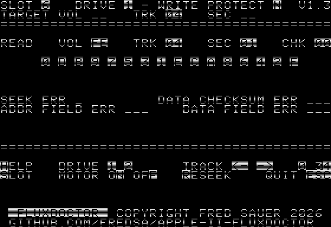

# **`FLUXDOCTOR`** V1.3 for Apple II computers

Diagnostic utility for real-time troubleshooting, calibration, and repair of
Apple II floppy disks drives. Runs natively on Apple II computer hardware.

- Drive spins indefinitely by default for easy troubleshooting
- Autostarts, no keyboard required to diagnose floppy drive read performance
- Provides direct low-level control to stop/start motor and seek heads
- Real-time display of sector read performance and errors
- Exposes weak reads and subtle intermittent errors hidden by DOS
- Distinguishes seek, checksum, and sector prologue/epilogue errors
- Can be used to diagnose poorly written or misaligned floppy disk drives

Available in multiple formats from the
[Releases](https://github.com/fredsa/apple-ii-fluxdoctor/releases) page:
- DISK: (140kB) DOS 3.3 floppy disk image (`*.DO`)
- TAPE: Cassette tape audio file (`*.WAV`)
- TYPE-IN: Machine language monitor type-in listing (`*.MON`)
- INSTA_DISK: self-writing disk audio file (`*.WAV`)



`FLUXDOCTOR` is written in 6502 assembly to provide low-level stepper and
spindle motor control without the need for a working DOS environment.


# Rendering artwork

SVG assets in the `artwork/` folder utilize the following fonts:

1. Arial

2. [Press Start 2P](https://fonts.google.com/specimen/Press+Start+2P), available
   in the `artwork/Press_Start_2P/` folder.

Assets will not render correctly without these fonts installed.


# Build prerequisites

To build FLUXDOCTOR from source, you'll need the following:

1. To be able to compile FLUXDOCTOR from source, install **dasm** assembler from
   https://dasm-assembler.github.io/

3. To manipulate disk images and add the compiled `FLUXDOCTOR` binary to a
   DOS 3.3 disk image, install **AppleCommander** from
   https://applecommander.github.io/ac/

4. (Windows only) To be able to run in the provided shell scripts, install
   [Git BASH](https://gitforwindows.org/), or install
   [Windows Subsystem for Linux (WSL)](https://en.wikipedia.org/wiki/Windows_Subsystem_for_Linux)


# Build instructions

To build FLUXDOCTOR, run the provied bash script:

```
./run.sh
```

# Writing physical floppy disks

To make a physical FLUXDOCTOR floppy disk, you have a few options:

## Greaseweazle

Purchase a [Greaseweazle](https://github.com/keirf/greaseweazle). Use the `gw`
command to write the 35-track 140kB `fluxdoctor.do` DOS 3.3 floppy disk image
using any PC or Shutgart 5.25" floppy drive to a double density floppy disk.

```
gw write out/fluxdoctor-1.3.do --tracks=step=2    # 96 TPI floppy drive
gw write out/fluxdoctor-1.3.do                    # 48 TPI floppy drive
```

## ADTPro

Use [ADTPro](https://github.com/ADTPro/adtpro) to write physical disk images
using your Apple II system, using an audio cable and cassette port on your
Apple II.

## c2t

Thanks to [c2t](https://github.com/datajerk/c2t), the same tool that powers
https://asciiexpress.net/, you can write a new FLUXDOCTOR disk, even if you
don't (yet) have a bootable floppy disk.

Simply:
1. Connect your phone or laptop via an audio cable to the Apple II tape in port.
2. Insert a blank disk into drive 1 (slot 6)
3. Type `LOAD` on the Apple II
4. Play the audio file: `fluxdoctor-insta-disk-1.3.wav`


# Testing

During development it's not always convenient to test on real hard. There are
many suitable Apple II emulators available, see:
   - Web browser: [appleiijs](https://www.scullinsteel.com/apple2/) /
     [appleiijse](https://www.scullinsteel.com/apple//e)
   - Linux / macOS: see
     https://en.wikipedia.org/wiki/List_of_computer_system_emulators#Apple_II
   - Windows: **AppleWin** from https://github.com/AppleWin/AppleWin
